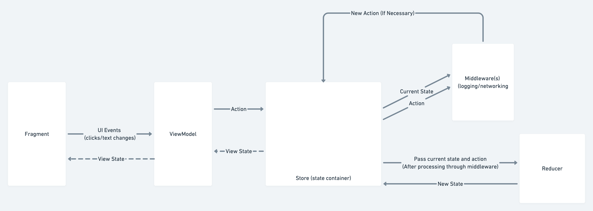

# MVI Example

This application was streamed live on Twitch to demonstrate how to build an application using MVI. 

You can find the VOD here for now: https://www.twitch.tv/videos/1036306656

And on YouTube: https://www.youtube.com/watch?v=wTJX_lWdh60

Much of the codebase is documented, but you can expect a blog post coming soon as well. 

## MVI Diagram

During the stream we created a diagram to understand the flow of data in an MVI application, which you can find here. This may be helpful to review before looking into the codebase:

